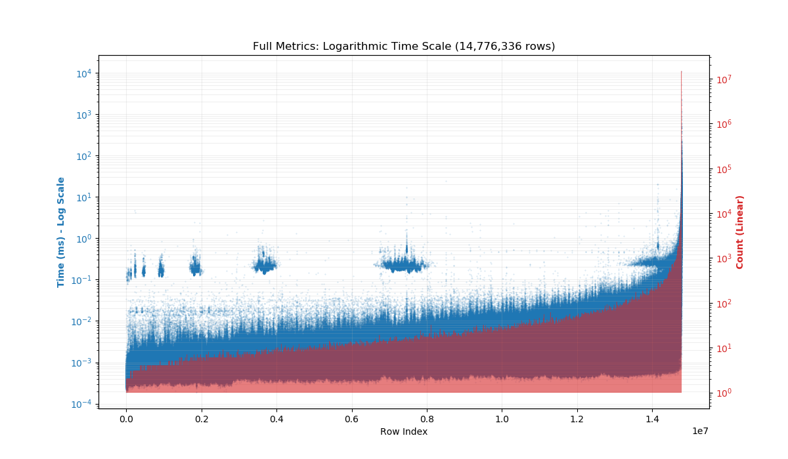
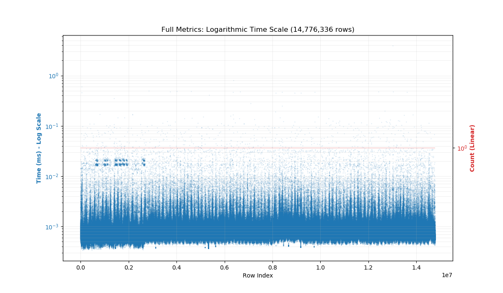

# golang Feistel URL Shortener

[](https://go.dev)
[](LICENSE)
[](https://goreportcard.com/report/github.com/ttodorovbg/go-feistel-url-shortener)
[](https://codecov.io/gh/ttodorovbg/go-feistel-url-shortener)
[](https://github.com/ttodorovbg/go-feistel-url-shortener/actions/workflows/ci.yaml)

## Core Requirements

A production-ready URL shortener must balance two critical properties:

| Requirement   | Why It Matters                                                                   |
| ------------- | -------------------------------------------------------------------------------- |
| Unpredictable | Prevents enumeration attacks, scraping, and unauthorized access to private links |
| Reversible    | Enables fast resolution: short code to original URL without brute-force search   |

Note: "Reversible" in this context means the system can map a short code back to its original URL, typically via a lookup table or cryptographic decryption. Base62 encoding alone is reversible (code to integer), but does not recover the original URL without additional storage or logic.

---

## Why Base62 Encoding?

Most URL shorteners use Base62 encoding because it:

- Uses only URL-safe characters: A-Z, a-z, 0-9
- Avoids special characters that may require percent-encoding or cause issues in browsers, emails, or QR codes
- Is simple to implement and decode
- Provides a good balance of compactness and readability

Reference: [https://en.wikipedia.org/wiki/Base62](https://en.wikipedia.org/wiki/Base62)

### Character Set

`0123456789ABCDEFGHIJKLMNOPQRSTUVWXYZabcdefghijklmnopqrstuvwxyz`

Total characters: 62

### Capacity by Length

The number of unique codes grows exponentially: 62^length

| Length | Unique Codes                  | Approximate |
| ------ | ----------------------------- | ----------- |
| 1      | 62                            | 62          |
| 2      | 3,844                         | 3.8K        |
| 3      | 238,328                       | 238K        |
| 4      | 14,776,336                    | 14.8M       |
| 5      | 916,132,832                   | 916M        |
| 6      | 56,800,235,584                | 56.8B       |
| 7      | 3,521,614,606,208             | 3.5T        |
| 8      | 218,340,105,584,896           | 218T        |
| 9      | 13,537,086,546,263,552        | 13.5P       |
| 10     | 839,299,365,868,340,224       | 839P        |
| 11     | 52,036,560,683,837,093,888    | 52E         |
| 12     | 3,226,266,762,397,899,821,056 | 3.2Z        |

Rule of thumb: 7 characters (~3.5 trillion combinations) is sufficient for most public-facing services. 8+ characters future-proofs against exhaustion.

---

## RFC 3986: URL-Safe Characters

All Base62 characters (0-9, A-Z, a-z) are unreserved per RFC 3986 Section 2.3 and never require percent-encoding.

Reference: [https://tools.ietf.org/html/rfc3986#section-2.3](https://tools.ietf.org/html/rfc3986#section-2.3)

## Capacity and Depletion Time Comparison

### Base62

| Length | Total Combinations      | At 100 codes/sec | At 1000 codes/sec |
| ------ | ----------------------- | ---------------- | ----------------- |
| 2      | 3,844                   | 38.4 seconds     | 3.8 seconds       |
| 3      | 238,328                 | 39.7 minutes     | 4.0 minutes       |
| 4      | 14,776,336              | 1.7 days         | 4.1 hours         |
| 5      | 916,132,832             | 106.0 days       | 10.6 days         |
| 6      | 56,800,235,584          | 18.0 years       | 1.8 years         |
| 7      | 3,521,614,606,208       | 1.1K years       | 111.7 years       |
| 8      | 218,340,105,584,896     | 69.2K years      | 6.9K years        |
| 9      | 13,537,086,546,263,552  | 4.3M years       | 429.3K years      |
| 10     | 839,299,365,868,340,224 | 266.1M years     | 26.6M years       |

## Numeric adaptation of Feistel cipher

How Feistel Shortener Works
A Feistel-based URL shortener applies the Feistel cipher structure to sequential integers, transforming them into unpredictable, fixed-length short codes.

[https://en.wikipedia.org/wiki/Feistel_cipher](https://en.wikipedia.org/wiki/Feistel_cipher)

This approach combines the simplicity of auto-incrementing IDs with the security of cryptographic obfuscation.
Workflow:

- Input: A sequential integer (e.g., 1, 2, 3, ...) serves as the plaintext message. This is typically generated by a database sequence, atomic counter, or distributed ID generator.
- Encryption: The integer is processed through a Feistel network using a fixed secret key. The cipher operates directly on the numeric domain, applying multiple rounds of modular arithmetic and shuffling.
- Output Encoding: The resulting ciphertext is a unique integer within the same range as the input. This number is encoded into Base62 to produce the final short code.
- Decryption: To resolve a short code, the Base62 string is decoded back to an integer, then decrypted using the same key and reversed round order. This recovers the original sequential ID instantly, without requiring a database lookup.

### Key Characteristics:

- Unpredictable: The output appears statistically random. Enumeration or brute-force attacks are infeasible without the secret key.
- Reversible: The mapping is a strict mathematical bijection. Every valid short code corresponds to exactly one original ID.
- Collision-Free: Because the Feistel structure is invertible within the defined domain, duplicate codes are mathematically impossible.
- Fixed Range: The cipher operates within a domain of size 62^length. For a code length of N, it securely maps integers from 0 to 62^N - 1.

### Important Clarification:

The output is cryptographically derived ciphertext, not a hash. Cryptographic hashes are one-way and irreversible by design. Feistel encryption is explicitly constructed to be decrypted, making it ideal for stateless short code resolution while maintaining unpredictability.

## Metrics

Here is a comparision with url shortenr with length **4 chars** for:

- Random generation
- Feistel generation

Number of generated codes: **14 776 336**

### Random code generation

Total time for generation all codes: **206 749ms**



### Feistel code generation (4 rounds)

Total time for generation all codes: **9 871ms**



### Comparison: Random vs. Feistel Code Generation

**Dataset:** 14,776,336 records (62^4 combinations) for each method

| Metric                             | Random Generation | Feistel Generation |
| ---------------------------------- | ----------------- | ------------------ |
| **Counts Statistics**              |                   |                    |
| Average                            | 17.06             | 1.00               |
| Median                             | 2.00              | 1.00               |
| Std Dev                            | 4,896.89          | 0.00               |
| Min                                | 1                 | 1                  |
| Max                                | 14,763,617        | 1                  |
| **Time Statistics (milliseconds)** |                   |                    |
| Average                            | 0.0140 ms         | 0.0007 ms          |
| Median                             | 0.0012 ms         | 0.0006 ms          |
| Std Dev                            | 3.7794 ms         | 0.0013 ms          |
| Min                                | 0.0002 ms         | 0.0003 ms          |
| Max                                | 10,945.4333 ms    | 3.9824 ms          |
| P95                                | 0.0162 ms         | 0.0009 ms          |
| P99                                | 0.0926 ms         | 0.0015 ms          |

## Installation

### As a Go Package

Add the dependency to your project:

```bash
go get github.com/ttodorovbg/go-feistel-url-shortener/pkg/codec
```

### As a CLI Tool

Clone and build the binary:

```bash
git clone https://github.com/ttodorovbg/go-feistel-url-shortener.git
cd go-feistel-url-shortener
go build -o go-feistel-url-shortener ./cmd/main.go
```

Or install directly via Go:

```bash
go install github.com/ttodorovbg/go-feistel-url-shortener/cmd@latest
```

## Usage as a Package

### Instance-Based API (Recommended)

Create a configured codec instance and reuse it across your application:

```go
import "github.com/ttodorovbg/go-feistel-url-shortener/pkg/codec"

c := codec.NewCodec(
    codec.WithKey(key),
    codec.WithLength(length),
    codec.WithRounds(rounds),
)

// Generate a short code from a sequential counter
code, err := c.GenerateHash(counter)
if err != nil {
    // handle error
}

// Reverse a short code back to the original counter
counter, err := c.ReverseHash(shortCode)
if err != nil {
    // handle error
}
// counter is *big.Int containing the original uint64 value
```

### Instance Configuration (NewCodec)

When creating a new instance using `codec.NewCodec()`, you can configure it using the following functional options:

| Option       | Argument Type | Default | Constraints  | Description                                   |
| :----------- | :------------ | :------ | :----------- | :-------------------------------------------- |
| `WithKey`    | `string`      | `*No*`  | Min 16 chars | Sets the cryptographic salt for the instance. |
| `WithLength` | `int`         | `7`     | `8` to `36`  | Sets the fixed length of generated hashes.    |
| `WithRounds` | `int`         | `6`     | `1` to `10`  | Sets the number of obfuscation rounds.        |

### Instance Methods

Once the instance is created, you can use these methods to process data:

| Method         | Input Type       | Return Type         | Description                                           |
| :------------- | :--------------- | :------------------ | :---------------------------------------------------- |
| `GenerateHash` | `counter uint64` | `(string, error)`   | Encodes the counter using instance settings.          |
| `ReverseHash`  | `code string`    | `(*big.Int, error)` | Decodes a hash back to its original `*big.Int` value. |

> **Note:** The instance-based API is **thread-safe** and more efficient for multiple operations as it pre-calculates configuration states.

### Static Function API

```go
import "github.com/ttodorovbg/go-feistel-url-shortener/pkg/codec"

// Generate with explicit parameters
code, err := codec.GenerateHash(counter, length, key, rounds)

// Reverse with explicit parameters
counter, err := codec.ReverseHash(shortCode, key, rounds)
```

### Configuration & Parameters

The following parameters are used to configure the behavior of the codec. When using `NewCodec`, these are passed as functional options.

| Parameter | Type     | Default    | Valid Values / Validation | Description                                     |
| :-------- | :------- | :--------- | :------------------------ | :---------------------------------------------- |
| `key`     | `string` | **NO**     | Range: `8` - `36` chars   | Used for salt and encryption of the hash.       |
| `length`  | `uint8`  | `7`        | Range: `1` - `10`         | The desired length of the generated short code. |
| `rounds`  | `uint8`  | `6`        | `3` to `10`               | Number of obfuscation rounds.                   |
| `counter` | `uint64` | _Required_ | `> 0`                     | The sequential ID you want to encode/hash.      |

> **Note:** If any parameter fails validation, the functions will return a non-nil `error`.

### API Return Types

| Method         | Return Type         | Description                                                         |
| :------------- | :------------------ | :------------------------------------------------------------------ |
| `GenerateHash` | `(string, error)`   | Returns the short code or an error if parameters are invalid.       |
| `ReverseHash`  | `(*big.Int, error)` | Returns the original value as a `*big.Int` to handle large numbers. |

> **Pro Tip:** To convert a `*big.Int` result back to `uint64`, you can use the `.Uint64()` method:  
> `originalValue := counter.Uint64()`
